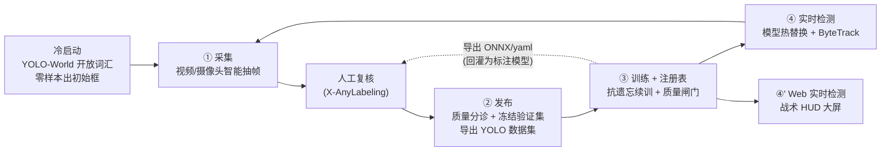

# SE-Hunter · 复杂密林发射井区域可疑目标智能检测系统

SE-Hunter 是一套面向**复杂密林发射井区域**的可疑目标智能检测系统。它在开源标注工具 [X-AnyLabeling](https://github.com/CVHub520/X-AnyLabeling) 的基础上二次开发，把"标注 — 训练 — 部署"三件原本割裂的工作，重组成一条**可自我演化（self-evolving）的闭环流水线**：系统一边在真实画面里做检测，一边把新场景的数据采集、标注、训练成更强的模型并自动上线，从而在样本稀少、目标形态多变的密林环境中持续提升识别能力。

与"训练一个固定权重然后部署"的常规做法不同，SE-Hunter 的核心命题是：**让检测模型在使用过程中自己变强**，并且整个过程对操作者是可控、可回退、可观测的。

---

## 一、要解决的问题

发射井区域的目标检测有几个先天困难：

- **场景特殊、公开数据极少**：密林、伪装、复杂光照下的可疑人员/车辆，几乎没有现成的标注数据集可用，模型必须从零冷启动。
- **目标形态会持续变化**：季节、植被、伪装方式都会变，一次性训练的模型很快就会"过时"。
- **小样本持续训练容易"学了新的忘了旧的"**（灾难性遗忘），简单地拿新数据反复微调，往往整体精度不升反降。
- **既要持续训练、又要全程值守**：训练和在线监控如果互相打断，系统就没有实战价值。

SE-Hunter 用一条闭环流水线、配合一组工程化的"安全机制"来回应上述困难（详见第三节）。

---

## 二、自我演化闭环

系统的全部核心能力，按流水线顺序聚合在主程序的 **「自进化」菜单**下，首尾相接形成闭环：



**冷启动 —— YOLO-World 开放词汇检测**
没有任何标注数据时，先用 YOLO-World 做开放词汇（open-vocabulary）检测：只需给出一组类别名（如 person、car、truck 等），即可零样本地框出目标，产出系统的第一批伪标注和初始种子模型，从而绕开"没有数据就训不出模型、没有模型又标不了数据"的死结。

**① 采集（Data Collection）**
从视频文件或摄像头按策略智能抽帧，而非逐帧硬存。抽帧策略为"变化触发（帧差）＋ 可选的检测触发（当前模型检到目标才存）＋ 最短间隔去抖 ＋ 最长间隔兜底"，只保留**有价值且不冗余**的帧；采集完成后可一键用当前线上模型自动预标注成 X-AnyLabeling 格式，直接进入复核。采集结果按时间命名落盘到 `capter/`。

**人工复核（Human-in-the-loop）**
在 X-AnyLabeling 主界面里复核、修正自动标注。系统的质量分诊会把"边界/可疑"的帧优先标记出来，让人力花在最有学习价值的样本上。

**② 发布（Publish Dataset）**
把复核后的标注按"置信度 + 几何质量"做 **keep / review / reject 三档分诊**，再选择性导出为 Ultralytics 可直接训练的 YOLO 数据集。这一步最关键的设计是**冻结验证集（frozen validation set）**：验证集一旦建立，后续只追加、绝不重洗，成为跨所有训练轮次都不变的"尺子"——没有这把不变的尺子，后面判断"新模型到底有没有变好"就失去了客观依据。

**③ 训练 + 模型注册表（Train & Registry）**
从当前线上模型继续训练（持续学习），训完在**冻结验证集**上评测，然后进入模型注册表过"质量闸门"：候选模型只有在主指标（mAP50-95）上**严格优于**当前线上模型才会被提升（promote）上线，否则保留为**可随时回退**的历史版本。注册表记录每个版本的指标、血缘、状态，并保存自包含、可移植的权重副本。

**④ 实时检测（Live Detection）**
摄像头/视频经当前线上模型做 ByteTrack 跟踪，画稳定 ID 的检测框与状态角标。后台线程持续监听注册表，一旦有更好的模型被提升，便在不中断画面的前提下**热替换**进来。

**④' Web 实时检测（Web Detection）**
把同一套真实检测管线推送到浏览器，呈现为一块战术风格的 HUD 大屏：实时视频流（MJPEG）、目标列表与置信度、威胁等级、雷达动效、模型版本与热替换提示。仅依赖 Python 标准库，默认监听本机，可从主程序一键启动。HUD 按类别名粗分敌我（可疑/敌/车辆/热源 → 威胁；友方/我方/平民 → 友军；树木/植被 → 中性）。

**闭环回流**
每次训练登记后，系统会顺带把模型导出为 ONNX 及两份 X-AnyLabeling 可加载的 yaml 配置，使**自我演化出的模型能直接回灌为标注工具里的自定义模型**——下一轮采集与预标注就用上了刚刚变强的模型，闭环就此闭合回自身。

---

## 三、关键技术与工程要点

这套系统真正的难度不在"调用 YOLO 训练"，而在于让闭环跑得**科学、稳定、不退化**。以下几点是核心：

**冻结验证集——可信的演化基准。** 验证集只增不减、不重洗，是整个"模型是否变好"判断的客观地基。发布环节还做了保护单样本类不被掏空、按类保证验证样本等小数据集工程处理，避免极端小样本下指标失真。

**质量闸门 + 可回退——杜绝"越训越差被推上线"。** 候选模型必须严格优于现役模型才上线；不达标则留作可回退历史。本仓库的真实记录里，`m_0007`（仅训练 20 轮，mAP50-95=0.306）就被闸门正确拦下，系统保持 `m_0006`（0.685）为现役，未让较差的新模型上线。

**抗遗忘（持续学习）——小数据反复续训不丢通用能力。** 系统集成了多种标准手段：经验回放（把 coco128 等历史样本按类名重映射混入训练）、冻结主干层、续训使用更小的学习率、以及 LwF 知识蒸馏（让旧模型当 teacher 给无标注图打伪标注）。

**双缓冲原子热替换——训练时识别不中断、不崩溃。** 新模型在后台槽位完成加载与预热（耗时操作在锁外），就绪后仅原子地切换一个指针（锁内、极快）；加载新模型期间推理始终使用旧模型，切换瞬间识别不停顿；新模型加载失败则保留旧模型，在线服务绝不崩溃。

**检测框连续过渡——画面平滑、换模型不跳变。** 跨帧做逐类 IoU 关联与 EMA 平滑，并配合渐入渐出。热替换瞬间，新模型给出的框会被平滑地"滑"到新位置，视觉上呈现"框越收越准"的过渡，而目标 ID 保持不变。在线监控则用 Ultralytics 内置 ByteTrack 维持稳定 ID，配合 4K 降采样与丢帧追帧保证实时性。

---

## 四、真实演化结果

`yolo/datasets/registry/registry.json` 保存了一次完整的端到端演化记录。随着采集与标注数据的累积，现役模型的主指标（mAP50-95）稳步爬升：

| 版本 | 状态 | mAP50-95 | mAP50 | 精确率 | 召回率 | 训练说明 |
| --- | --- | --- | --- | --- | --- | --- |
| m_0001 | 种子 | 0.000 | 0.000 | 0.00 | 0.00 | 冷启动，27 用户图 + 114 回放，freeze10、lr0.001 |
| m_0002 | — | 0.047 | 0.059 | 0.05 | 0.24 | 27 用户图，50 轮 |
| m_0003 | — | 0.049 | 0.064 | 0.04 | 0.29 | resume 续训 |
| m_0004 | — | 0.248 | 0.316 | 0.62 | 0.27 | 78 用户图，50 轮 |
| m_0005 | — | 0.654 | 0.759 | 0.86 | 0.63 | 108 用户图 + 114 回放，coco128 + 蒸馏 |
| **m_0006** | **现役** | **0.685** | **0.783** | **0.80** | **0.67** | 110 用户图 + 114 回放，coco128 + 蒸馏 |
| m_0007 | 被闸门拦下 | 0.306 | 0.365 | 0.74 | 0.25 | 110 用户图，仅 20 轮（劣于现役，未上线） |

整个过程共进行了 20 余次训练、登记了 7 个模型版本。类别表也从早期混入审查标记的版本，经清理工具压缩为干净的正式类别集合。

---

## 五、目录结构

```
SE-Hunter-local/
├── Labeling/                         主程序：X-AnyLabeling 二次开发版（核心）
│   └── anylabeling/services/auto_training/   自我演化系统服务层（核心代码）
├── yolo/                             YOLO 推理 / 自动标注分阶段实验，含真实演化记录
├── yolo_world/                       YOLO-World 开放词汇检测复现（冷启动种子来源）
├── vedio/                            演示视频素材（4K / 60fps），采集与检测的输入示例
├── capter/                           采集会话输出（按时间命名，含抽帧图、标注 JSON、session.json）
├── test/                             浏览器前端 demo（静态页、MediaPipe 摄像头交互页）
└── races/                            C++/CMake 最小示例（与主系统无关的脚手架，可忽略）
```

| 目录 | 作用 | 入口 |
| --- | --- | --- |
| `Labeling` | 主程序。在 X-AnyLabeling 基础上集成「自进化」菜单与自我演化服务层 | `Labeling/LOCAL_SETUP.md` |
| `Labeling/anylabeling/services/auto_training` | 系统核心：采集、发布、训练、注册表、热替换推理服务、Web 服务、抗遗忘 | 见下方模块说明 |
| `yolo` | YOLO 推理与自动标注实验；`datasets/registry/` 内含真实模型演化记录 | `yolo/README.md` |
| `yolo_world` | YOLO-World 开放词汇检测复现，为冷启动提供初始伪标注 | `yolo_world/README.md` |
| `vedio` | 演示用视频（如 `15125784_3840_2160_60fps.mp4`） | 直接作为采集/检测来源 |
| `capter` | 采集会话产物 | 由「采集」功能自动写入 |
| `test` | 前端演示页面 | `test/README.md` |
| `races` | C++ 示例脚手架 | 可忽略 |

### 自我演化服务层核心模块（`Labeling/anylabeling/services/auto_training/`）

| 文件 | 职责 |
| --- | --- |
| `collector.py` | 采集：智能抽帧策略（变化/检测触发、去抖、兜底）与会话写入 |
| `publish_dataset.py` | 发布：质量三档分诊、冻结验证集、导出 YOLO 数据集 |
| `model_registry.py` | 模型注册表：版本/血缘/指标管理、质量闸门 promote、回退 |
| `train_with_registry.py` | 训练 runner：续训 → 冻结验证集评测 → 过闸门登记（含 train/eval/resume/list/rollback 等子命令） |
| `replay.py` | 抗遗忘：经验回放数据组装、类名重映射、LwF 伪标签蒸馏 |
| `model_server.py` | 双缓冲推理服务 + 注册表驱动的原子热替换 + ByteTrack 跟踪接口 |
| `box_smoother.py` | 检测框连续过渡：跨帧 IoU 关联 + EMA 平滑 + 渐入渐出 |
| `live_runtime.py` | 实时主循环：热替换推理 + 框平滑 + 角标绘制（命令行版） |
| `web_server.py` | Web 实时检测服务：MJPEG 流 + 状态 JSON + 战术 HUD 前端 |
| `se_hunter_web.html` | Web HUD 前端页面 |
| `export_artifacts.py` | 登记后导出 ONNX 与 X-AnyLabeling 可加载的 yaml 配置（闭环回流） |
| `augment_from_coco.py` / `clean_review_classes.py` | 数据集运维：按类名注入 COCO 样本、清理审查标记并压缩类别表 |

---

## 六、环境要求

- **操作系统**：Windows 10/11 优先；Python 部分亦可在 Linux/macOS 上按官方依赖适配。
- **Python**：推荐 3.12；主程序 `Labeling` 要求 3.11 及以上。
- **环境管理**：建议每个子项目单独使用 `venv` 或 conda 环境，避免包版本互相影响（尤其不要在同一环境同时装 `onnxruntime` 和 `onnxruntime-gpu`）。
- **GPU**：推理可用 CPU 先跑通；持续训练建议使用 GPU。单卡显存有限时，可让训练独占 GPU、在线推理走 CPU，互不抢显存。
- **浏览器**：`test/camera-interact.html` 与 Web HUD 需要现代浏览器；摄像头页面需授予摄像头权限。

---

## 七、快速开始

### 1. 启动主程序（自我演化闭环）

```powershell
cd Labeling
py -3.12 -m venv .venv-cpu
.\.venv-cpu\Scripts\Activate.ps1
python -m pip install -U pip uv
uv pip install -e ".[cpu]"
xanylabeling checks
xanylabeling
```

启动后，全部闭环功能都在顶部 **「自进化」菜单** 下，按 采集 → 发布 → 训练 → 实时检测 / Web 实时检测 的顺序使用即可。GPU 版本、CUDA 适配与常见问题见 `Labeling/LOCAL_SETUP.md`。

### 2. 命令行驱动闭环（可选，与 GUI 同一套逻辑）

发布、训练、推理服务也提供命令行入口，便于自动化或在无界面环境运行（需先在 `Labeling` 目录完成 editable 安装）。`--dataset` 不指定时会读取主程序在发布面板设置并持久化的数据集目录。

```powershell
# ② 发布：扫描标注 -> 三档分诊 manifest -> 导出 YOLO 数据集
python -m anylabeling.services.auto_training.publish_dataset scan <标注目录> --manifest manifest.csv
python -m anylabeling.services.auto_training.publish_dataset export manifest.csv --out <数据集目录>

# ③ 训练：从现役模型续训 -> 冻结验证集评测 -> 过闸门登记（更好才上线）
python -m anylabeling.services.auto_training.train_with_registry train --dataset <数据集目录> --epochs 50 --device 0
python -m anylabeling.services.auto_training.train_with_registry list      --dataset <数据集目录>   # 查看所有版本
python -m anylabeling.services.auto_training.train_with_registry rollback m_0005 --dataset <数据集目录>  # 回退现役

# ④ 实时检测（命令行版）：摄像头/视频 + 热替换 + 框平滑
python -m anylabeling.services.auto_training.live_runtime --source 0 --device cpu
```

### 3. YOLO 推理 / 自动标注实验

```powershell
cd yolo
py -3.12 -m venv .venv
.\.venv\Scripts\Activate.ps1
python -m pip install -U pip
pip install -r requirements.txt
python scripts\infer_coco128.py --device cpu
```

输出写到 `yolo/outputs/stage1_coco128_inference`。更多自动标注流程见 `yolo/README.md` 与 `scripts/` 下的两个 notebook。

### 4. YOLO-World 开放词汇检测复现（冷启动）

```powershell
cd yolo_world
py -3.12 -m venv .venv
.\.venv\Scripts\Activate.ps1
python -m pip install -U pip
pip install -r requirements.txt
python scripts\run_yolo_world.py --device cpu
```

默认类别为 `person, car, truck, bus, bicycle, motorcycle, umbrella, boat`，可用 `--classes` 自定义。输出写到 `yolo_world/outputs/`。

### 5. 前端演示

普通页面可直接双击 `test/index.html`；摄像头交互页面建议通过本地服务访问：

```powershell
cd test
python -m http.server 8000
```

然后打开 `http://localhost:8000/camera-interact.html`（需授予摄像头权限并保持 CDN 可访问）。

---

## 八、分享 / 复现注意事项

1. **保持目录结构与相对路径不变**，尤其是 `datasets`、`models`、`outputs`、`registry` 等会被代码引用的目录。
2. **模型权重需一并提供**（`.pt` / `.onnx` 等），否则推理与自动标注会缺模型。
3. **接收方先建虚拟环境再安装对应依赖**，不要直接在系统 Python 里混装。
4. notebook 建议从项目根目录或 `scripts/` 目录打开，避免旧的绝对路径兜底逻辑被触发。
5. 命令行模块需先在 `Labeling` 目录完成 `uv pip install -e ".[cpu]"`，`anylabeling.services.auto_training.*` 才可作为模块运行。
